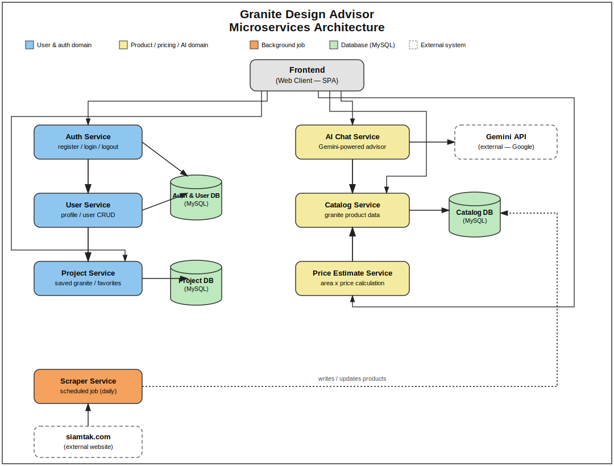

# Microservices Architecture — Granite Design Advisor

## ภาพรวม

ระบบออกแบบเป็น 3 กลุ่ม service หลัก แบ่งตามหน้าที่ (domain-driven), แต่ละ service มีฐานข้อมูลของตัวเอง (database-per-service pattern) เพื่อแยกความรับผิดชอบให้ชัดเจนตามหลัก microservices

## รายละเอียดแต่ละ Service

### 🔵 User & Auth Domain
| Service | หน้าที่ | สถานะ |
|---|---|---|
| **Auth Service** | register / login / logout | ยังไม่ implement |
| **User Service** | จัดการโปรไฟล์ผู้ใช้ (CRUD) | ยังไม่ implement |
| **Project Service** | เก็บหิน/โปรเจกต์ที่ผู้ใช้บันทึกไว้ | ปัจจุบันทำงานแบบ client-side (`localStorage`) ยังไม่ใช่ service จริง |

ทั้งสาม service ใช้ฐานข้อมูลร่วมกัน 2 ชุด: **Auth & User DB** และ **Project DB** (แยกกันตาม bounded context)

### 🟡 Product / Pricing / AI Domain
| Service | หน้าที่ | สถานะ |
|---|---|---|
| **AI Chat Service** | แชทบอทแนะนำหิน ขับเคลื่อนด้วย Gemini API | ✅ ทำงานจริงแล้ว (`routers/Chat.py`) |
| **Catalog Service** | ข้อมูลหินแกรนิต/หินอ่อน | ✅ ทำงานจริงแล้ว แต่ยังอ่านจากไฟล์ CSV ไม่ใช่ Catalog DB ตามที่ออกแบบไว้ |
| **Price Estimate Service** | คำนวณราคาจากพื้นที่ | ✅ ทำงานจริงแล้ว (`routers/Estimate.py`) |

AI Chat Service และ Price Estimate Service ทั้งคู่เรียกไปหา Catalog Service เพื่อขอข้อมูลหิน แทนที่จะเก็บข้อมูลซ้ำกันเอง (single source of truth)

### 🟠 Background Job
| Service | หน้าที่ | สถานะ |
|---|---|---|
| **Scraper Service** | ดึงข้อมูลหินจาก siamtak.com ตามรอบเวลา | ✅ โครงสร้างพร้อมใช้ (`scrape_granite.py`) แต่ CSS selector ยังเป็นค่า placeholder ต้องปรับให้ตรงกับ HTML จริงของเว็บก่อนใช้งานจริง |

### ⚪ External Systems
- **Gemini API** (Google) — ให้บริการ AI Chat
- **siamtak.com** — แหล่งข้อมูลหินที่ scrape มา

## หมายเหตุสำคัญ

กรอบเส้นประในไดอะแกรมหมายถึง **"วางแผนไว้ แต่ยังไม่ได้ implement จริง"** (MySQL Database) — ตอนนี้ระบบยังใช้ไฟล์ CSV แทนฐานข้อมูลจริง รายละเอียดสถานะ "เสร็จ/ไม่เสร็จ" ของแต่ละส่วนดูเพิ่มเติมได้ที่ [`docs/self-assessment.md`](./self-assessment.md)
